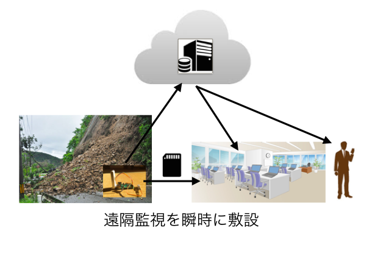
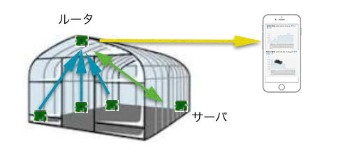
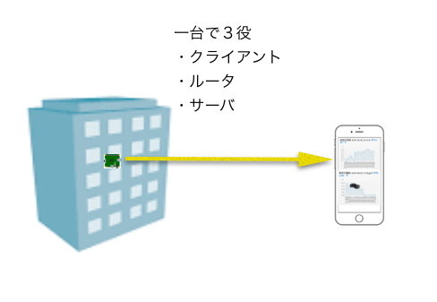
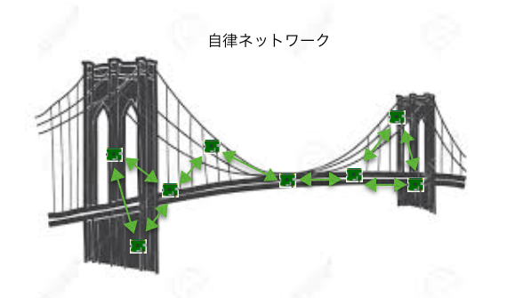

# 概要

slider は安価で汎用的な IoT 端末を提供するための Raspberry Pi のソフトウェアです。Raspbian OS とともに SD カードで提供されます。

  

クラウド上の遠隔モニターサービス "monitor" と連携させることで、必要な時に必要な場所の監視を迅速に実施することができます

IoT クライアントとしてだけでなく、 **ルーター** や **monitor サーバー** として利用することも可能なので ネットワーク環境の存在しない現場で **slider による臨時の WiFi ネットワーク** を構築することが可能です

さらに、**1台の slider だけ** でクライアントとしてデータを収集しつつ、ルーターとして現場のスマートフォンや PC にWiFi アクセスポイントを提供** しつつ、**monitor サーバとして収集したデータを共有** することが可能です

また、ルーターを使わない **アドホックモード** や、**自律的にネットワークを形成する MANET（モバイルアドホックネットワーク）** にも対応しているので、いろいろな現場で柔軟な WiFi ネットワークを即座に構築することが可能です

