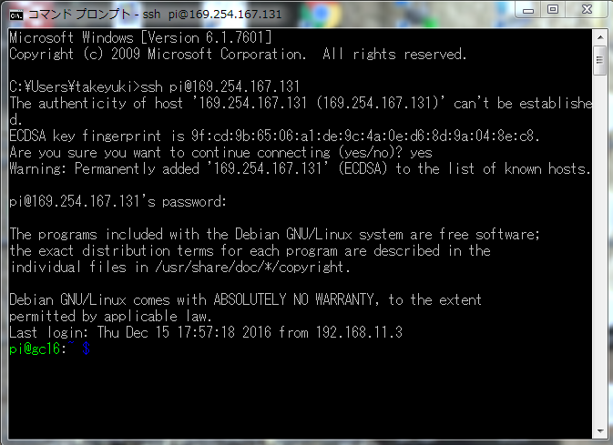
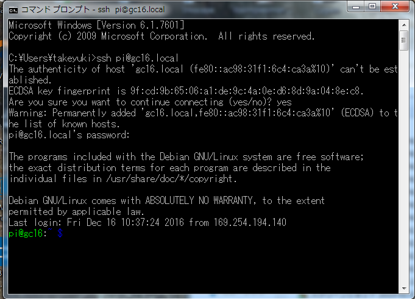
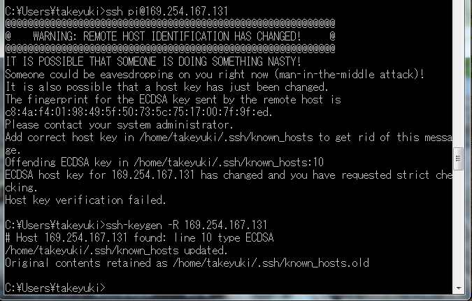
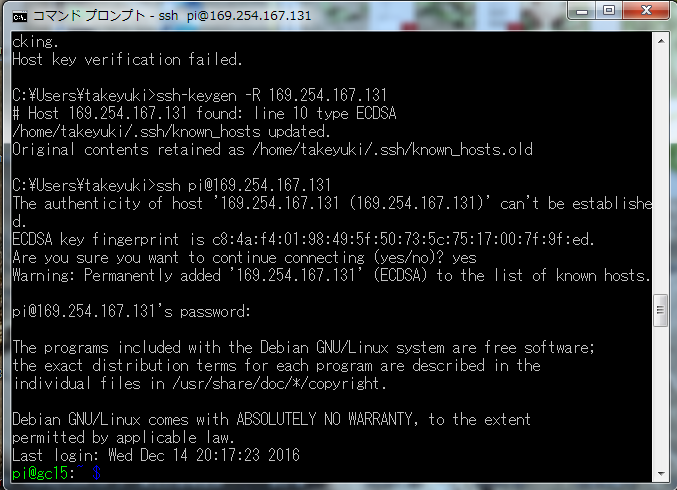
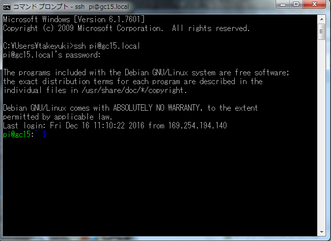

# ssh 接続
ホスト名.local もしくは IP adress を指定しての ssh での接続です  

複数の slider を操作していて、複数の slider に同じ IP address が割り当てられてしまう事があると、ssh はホストの詐称の可能性を疑い接続を拒絶します

そのような時は、ssh-keygen -R で一度、ID を削除すると、正常に接続できます

<!--  -->
